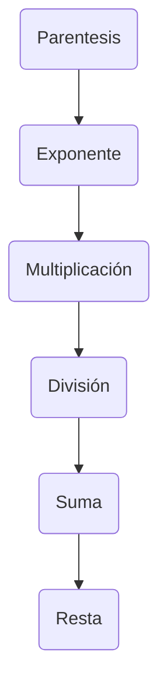

# Curso Udemy Python

### Operadores aritméticos
Operador de suma                +
Operador de resta                 -
Operador de negativo           -
Operador de multiplicación  *
Operador de exponente            **
Operador de división              /
Operador de  división entera //
Operador de modulo o resto %

### Reglas de precedencia
En orden de precedencia

