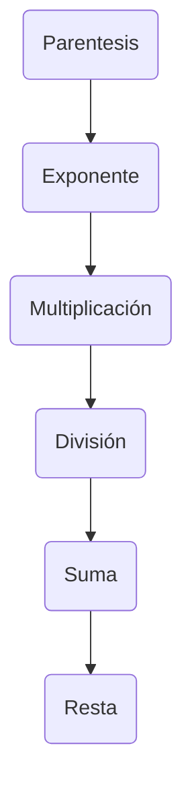

# Curso Udemy Python

### Operadores aritméticos

Operador de suma +
Operador de resta -
Operador de negativo -
Operador de multiplicación *
Operador de exponente **
Operador de división /
Operador de  división entera //
Operador de modulo o resto %

### Reglas de precedencia

En orden de precedencia

### Operadores de cadenas

Operador de concatenación +
Operador de repetición *

### Operadores de relación

Igual a ==
Distinto de !=
Mayor que >
Menor que <
Mayor o igual que >=
Menor o igual que <=

### Operadores de asignación

Asignación simple  =
Asignación suma +=
Asignación resta -=
Asignación multiplicación *=
Asignación exponente **=
Asignación división /
Asignación división entera //=
Asignación división mod/resto %=
